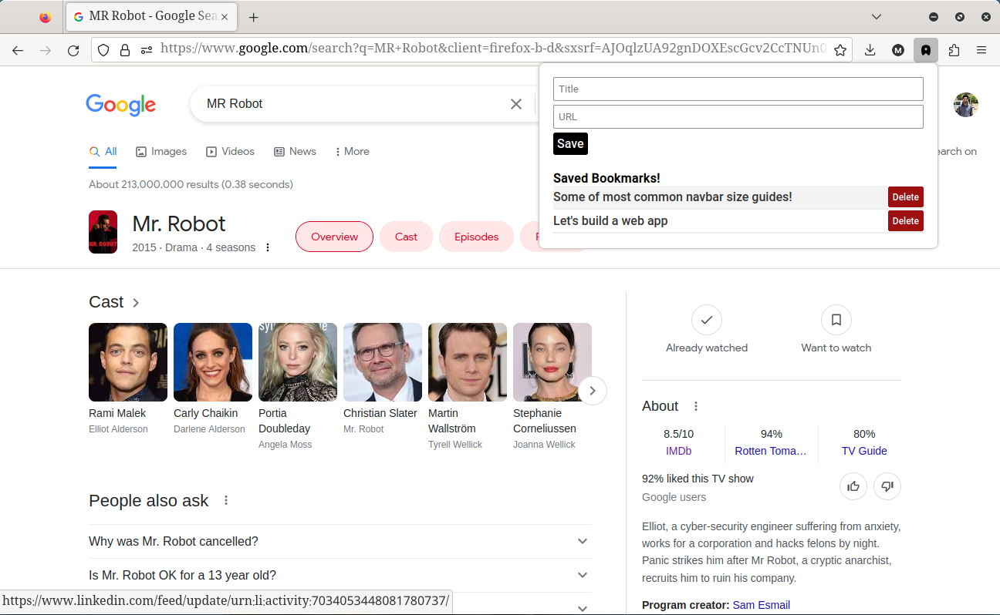

# Bookmark Saver

## Overview

  

Bookmark Saver is a Firefox add-on that allows users to create bookmarks by providing a title and URL, list all bookmarks that they have created, and delete any of them.

## Installation
To install Book Saver from Firefox Browser Add-ons:
1. Open the [project page](https://addons.mozilla.org/en-US/firefox/addon/bookmark-saver/) on Firefox Browser Add-ons.
2. Click on "Add to Firefox" button.

Alternatively, to install Bookmark Saver from your localhost, follow these steps:

1. Download the latest version of the add-on from the [release page](https://github.com/meldisoukyy/BookmarkSaver/releases).
2. Open Firefox and go to `about:addons`.
3. Click the gear icon in the top right corner and select "Install Add-on From File".
4. Navigate to the downloaded add-on file and select it.
5. Follow the prompts to complete the installation.

## Usage
Once installed, Bookmark Saver can be accessed by clicking on the add-on icon in the Firefox toolbar.

To create a bookmark, fill in the title and URL fields. Click "Save" to add the bookmark.

To delete a bookmark, click the "Delete" button next to the bookmark you want to remove.

## Contributing
Contributions to Bookmark Saver are welcome! To contribute, follow these steps:
1. Fork the repository and create a new branch.
2. Make your changes and commit them.
3. Push your changes to your fork.
4. Open a pull request.

Please make sure to include a detailed description of your changes in your pull request.

## License
Bookmark Saver is released under the [MIT License](https://opensource.org/license/mit/).